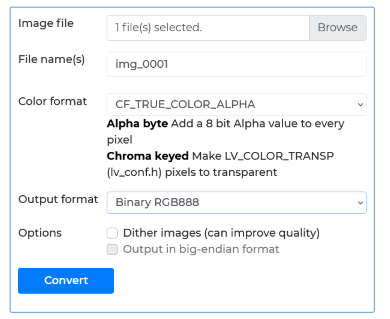

# MiWatchLuaWatchfaces

# [Русский](readmeRU.md)

### Xiaomi watchfaces examples running on LUA engine:  
  Mi Band 8 Pro,  
  Redmi Watch 4,  
  Mi Watch S3,  
  Mi Band 9,  
  Mi Band 9 Pro  

Samples for various Xiaomi models of LUA watchfaces.  
you can read more about LUA - https://www.lua.org/start.html  

Easyface can pack it - https://github.com/m0tral/Easyface  

These models are running on NuttX => https://nuttx.apache.org/docs/latest/   
and use most popular graphic library LVGL => https://lvgl.io/get-started

For images I use lvgl build-in converter => https://lvgl.io/tools/imageconverter  
  
   
Here is shown which params to set   
   
It's possible to debug all this stuff on PC cross-platform emulator,   
I personally prefer use Windows 10, under WSl2/Ubuntu subsystem.   
Will show you later how to do it.   

#### MiBand8Pro Examples   
 - Digital time => Simple digital clock with blinking delimiter   
 - Analog time  => Simple analog clock   
 - Analog time animated  => Simple analog clock with smooth second hand, animation + click event sample   
 - Accelerometer  => Example of usage of accelemoter as data source for animation object   
 - Diffusion  => Example dynamic watchface from Redmi Watch 4   
 - FlyingCat  => Example with accelemoter, animation, click event   

#### Redmi Watch 4 Examples   
 - Diffusion  => stock watchface sample   
   TouchEvents => touch events coords tracking   

#### MiBand9 Examples   
 - watchface_366269993  => stock watchface sample   

#### MiBand9 Pro Examples   
 - PointerTest  => widget Pointer sample   
 - AnalogTimeTest  => widget AnalogTime sample   
 - ImageBarTest  => widget ImageBar sample   

#### MiWatchS3 Examples   

going to update during watch/watchfaces develop process   

