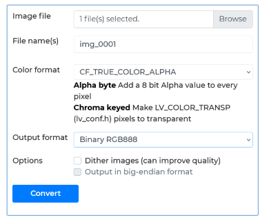

# MiWatchLuaWatchfaces

# [English](README.md)

### Примеры циферблатов Xiaomi на движке LUA, для часов Mi Band 8 Pro, Mi Watch S3

Тут вы можете ознакомиться с примерами циферблатов для различных часов Xiaomi.   
Ознакомиться с языком программирования LUA можно здесь - https://www.lua.org/start.html   

В помощью редактора Easyface можно упаковать циферблаты - https://github.com/m0tral/Easyface  

Данные модели часов работают на базе RTOS NuttX => https://nuttx.apache.org/docs/latest/   
и используют графическую библиотеку LVGL => https://lvgl.io/get-started

Чтобы сконвертировать картинки в нужный формат   
воспользуйтесь онлайн конфертором LVGL converter => https://lvgl.io/tools/imageconverter  
  
   
Тут показаны какие параметры нужно выбрать,   
чтобы получить картинку в нужном формате   
   
Данные приложения можно отлаживать на PC симуляторе,   
Я лично использую Windows 10, вместе с WSl2/Ubuntu.   
Позже добавлю как это делается.   

#### MiBand8Pro примеры
 - Digital time => пример простых цифровых часов с мигающим разделителем
 - Analog time  => пример аналоговых часов
 - Analog time animated  => пример аналоговых часов с плавной стрелкой, анимация + пример события: нажатие
 - Accelerometer  => пример использования данных акселероментра как источника данных для анимации обьекта

#### MiWatchS3 примеры

буду дополнять по мере наработок

